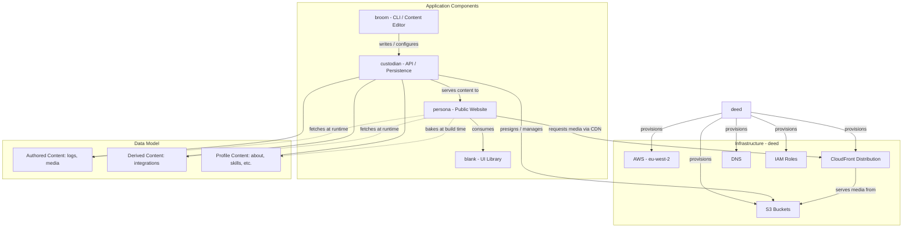

# Playground

A polyglot monorepo and digital space for learning, experimenting and practising smaller software concepts.

## Architecture Diagram

## Components

- **`custodian`**: The API that keeps the playground. It owns all content, serves it to `persona` at runtime, accepts writes from `broom`, and is the only component holding third-party credentials.
- **`broom`**: The command-line tool used to configure, edit and write content. It is a client of `custodian`'s API and has no storage or authority of its own.
- **`blank`**: The Web Components UI library. Consumed by `persona`.
- **`persona`**: The public website. Bakes profile content at build time and loads blogs and live status from `custodian` at runtime. Built with `blank`.
- **`deed`**: The infrastructure-as-code component. Provisions the EC2 instance, S3 buckets, CloudFront distribution, IAM roles, and DNS.
